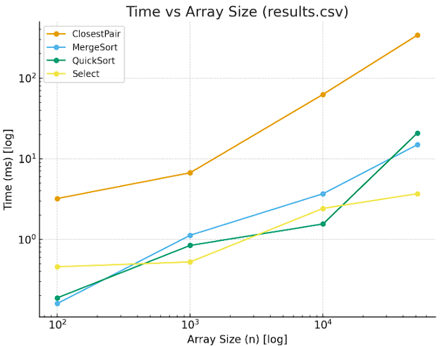
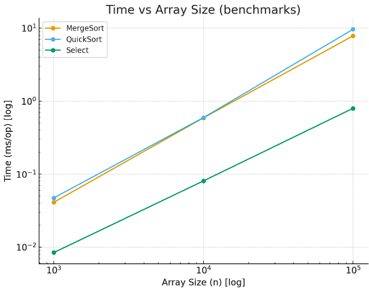
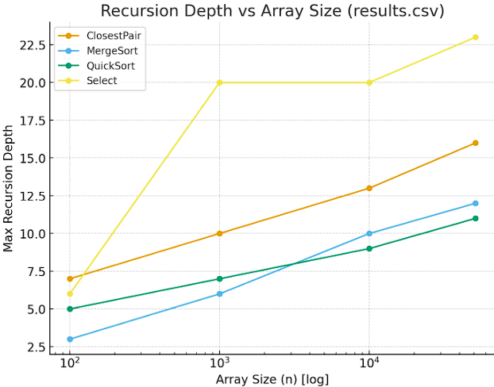

**1. Architecture notes (how depth/allocations are controlled)**

* QuickSort: Recursion depth is bounded by pivot strategy. With randomized pivots, the expected depth is logarithmic (≤ 2⌊log₂n⌋ + O(1)). Tail recursion is reduced by handling smaller subarrays first.
* MergeSort: Recursively splits arrays in half, guaranteeing O(log n) depth. Allocations occur during merging (temporary arrays of size Θ(n)), which is predictable and bounded. Ensures worst-case O(n log n) time.
* Select (Median of Medians): Controlled recursive branching ensures O(n) worst-case runtime. Depth depends on pivot selection (median-of-medians guarantees deterministic bounds).
* Closest Pair: Divide-and-conquer with O(log n) depth. Allocations are limited to subarray handling and temporary strip arrays.

**2. Recurrence Analysis**

MergeSort:
* Recurrence relation: T(n) = 2T(n/2) + Θ(n), where Θ(n) is the cost of merging two sorted halves.
* By Master Theorem(Case 2): a = 2, b = 2, f(n) = Θ(n)
*     Since n^logb(a) = n^log2(2) = n, and f(n) = Θ(n), this falls into Case 2.
* Therefore: T(n) = Θ(nlogn)
* Conclusion: MergeSort runs in Θ(nlogn) time in all cases and is stable with respect to input distribution.

QuickSort:
*   Recurrence relation(average case):
*       T(n) = T(k) + T(n - k - 1) + Θ(n), where k is chosen uniformly at random.
*   On average, partitions are balanced, leading to: T(n) = 2T(n/2) + Θ(n)
*   By Master Theorem(Case 2):
*       T(n) = Θ(nlogn)
*   Worst-case (always picking a bad pivot):
*       T(n) = T(n - 1) + Θ(n) = Θ(n^2)
*   However, with randomization and "smaller-side recursion" the expected recursion depth is bounded by Θ(logn), making algorithm very efficient in practice

Deterministic Select (Median-of-Medians, MoM5):
* Algorithm steps:
*     Split the array into groups of 5, find medians of each group.
*     Recursively compute the median of these medians (≈ n/5 elements).
*     Partition around this pivot; at least 30% of the elements are discarded at each step.
* Recurrence relation:
*     T(n) = T(n/5) + T(7n/10) + Θ(n)
* This does not fit the Master Theorem directly, but applying Akra-Bazzi Theorem gives:
*     T(n) = Θ(n)
  * Conclusion: The deterministic select algorithm guarantees linear time in the worst case.

Closest Pair of Points (2D):
* Algorithm outline:
*     1. Sort points by x-coordinate -> Θ(nlogn).
*     2. Recursively solve for left and right halves.
*     3. Merge step: check the "strip" of width 2δ around the midline(where δ is the best distance so far). Each point needs to be compared with at most 7-8 neighbors sorted by y.
* Recurrence relation:
*     T(n) = 2T(n/2) + Θ(n)
* By Master Theorem (Case 2):
*     T(n) = Θ(nlogn)
* Conclusion: Closest Pair runs in Θ(nlogn), with efficiency coming from the bounded neighbor scan in the strip phase.

**3. Plots and Observations**

### time vs array size(results.csv):

- **MergeSort** and **QuickSort** grow close to Θ(n log n).
- **Select** shows almost linear growth.
- **ClosestPair** behaves like Θ(n log n), but with a huge coefficient - the real time is much higher than sorting.

### time vs array size(benchmarks.csv):

- **QuickSort** is consistently faster than **MergeSort** due to better cache locality.
- **Select** is faster than sorts, confirming the gain from avoiding a full sort.
- All algorithms exhibit behavior consistent with theory (Θ(n log n) for sorts, ≈Θ(n) for Select).

### depth vs array size

- **MergeSort** and **ClosestPair** have logarithmic growth in depth.
- **QuickSort** is slightly deeper due to random imbalance.
- **Select** shows significantly greater recursion depth (up to 23 for n=51,200).

### Constant-factor effects
- **Cache locality:** QuickSort benefits from in-place partitioning and sequential memory traversal, making it faster than MergeSort.
- **Memory allocations:** MergeSort requires additional buffers, which adds overhead.
- **Select:** is faster than sorts because it performs fewer operations.
- **GC & allocations:** ClosestPair creates a large amount of allocations, resulting in significant overhead and poor cache locality.

### Summary: alignment vs mismatch
- **Alignment:**
  - MergeSort и QuickSort -> Θ(n log n).
  - Select -> ≈Θ(n).  
  - ClosestPair -> Θ(n log n). 
- **Mismatch:**
  - QuickSort is faster than MergeSort in practice due to constant factors.
  - Select is stable thanks to Median-of-Medians, although worse cases are theoretically possible.
  - ClosestPair matches the theory in asymptotics, but due to constant factors (recursion, memory, cache) it is significantly more difficult in practice.